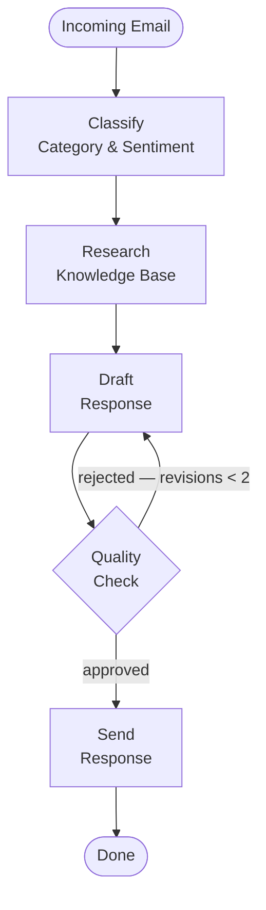

# Customer Support Email Agent

A LangGraph-based agent that processes and responds to customer support emails using LLM-powered classification, routing, and response generation. Runs entirely locally via [Ollama](https://ollama.com) — no external API keys required.

## Architecture



The agent uses a LangGraph state machine with the following stages:

1. **Classify** — Categorize the email (complaint, inquiry, refund, feedback, technical, other) and detect sentiment
2. **Research** — Semantic search over the knowledge base using FAISS
3. **Draft** — Generate a response using category-specific prompts
4. **Quality Check** — Validate tone, accuracy, and completeness; loop back to draft if needed (max 2 revisions)
5. **Send** — Finalize the response and record any required follow-ups

## Project Structure

```
src/
├── api/          — FastAPI routes and request handling
├── graph/        — LangGraph workflow definition and nodes
├── services/     — Business logic (email parsing, knowledge base lookup)
├── prompts/      — Prompt templates for each stage
├── schemas/      — Pydantic models for emails, state, and API contracts
├── core/         — App config, settings, and shared dependencies
├── utils/        — Logging, helpers
├── knowledge_base/ — Static support docs and FAQ data
tests/            — Unit and integration tests
```

## Setup

**1. Install Ollama**

Download and install [Ollama](https://ollama.com), then pull the required models:

```bash
ollama pull llama3.2
ollama pull nomic-embed-text
```

**2. Install dependencies**

```bash
python3.12 -m venv .venv
source .venv/bin/activate
pip install -r requirements.txt
cp .env.example .env
```

**3. Build the knowledge base index**

This must be run once before starting the server, or KB lookups will silently return no results:

```bash
python -m src.knowledge_base.build_index
```

## Run

```bash
uvicorn src.main:app --reload
```

Open `http://localhost:8000` to use the demo UI.

## Test

```bash
pytest tests/ -v
```

## API

| Method | Endpoint | Description |
|--------|----------|-------------|
| `POST` | `/api/v1/email/process` | Process an email through the agent |
| `GET` | `/api/v1/inbox` | List processed emails (paginated) |
| `GET` | `/api/v1/inbox/stats` | Inbox statistics |
| `GET` | `/api/v1/followups` | List pending follow-ups |
| `GET` | `/health` | Health check |
